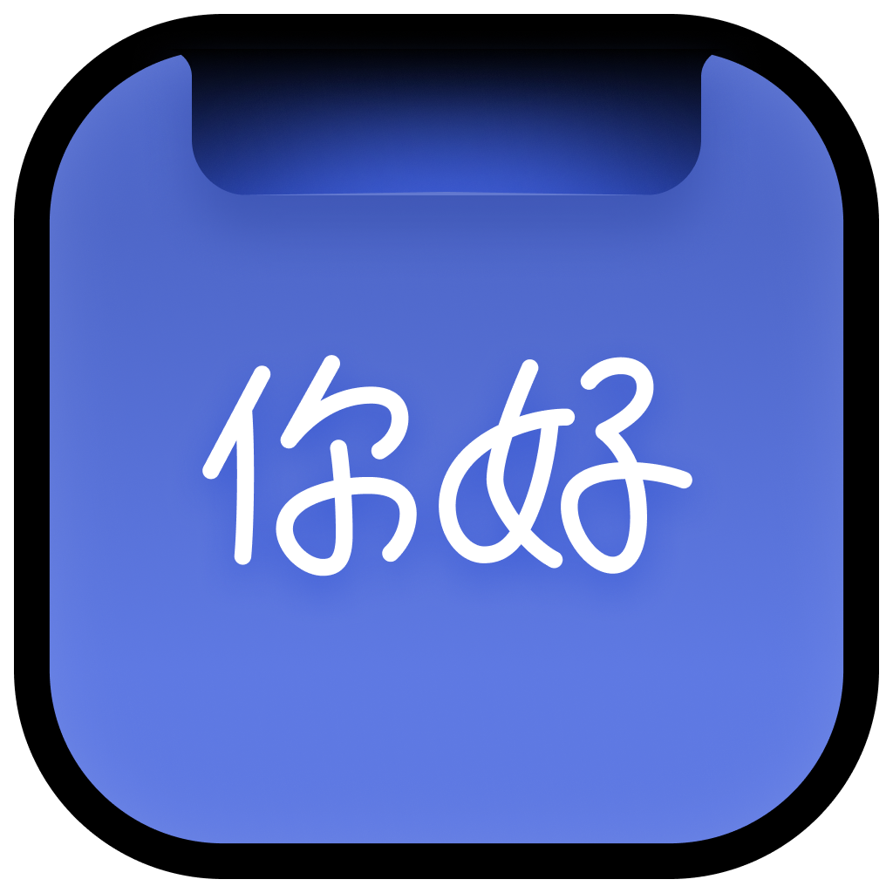

  

  <h1>EasyNotch</h1>

  
把常用工具放进 Mac 顶部刘海区，让工作流更顺手。

  

    <a href="https://easynotch.designbento.cn">官网</a>
    ·
    <a href="https://github.com/designerluojie/EasyNotch/releases">下载</a>
  

EasyNotch 是一款为 macOS 刘海屏打造的轻量效率工具箱。它将音乐控制、文件暂存、AI 对话、剪贴板和专注计时等常用功能，集中在屏幕顶部，减少窗口切换，让信息与操作随手可得。

## 功能

### 🎵 音乐控制

在刘海区查看当前播放信息，控制播放、暂停、上一首和下一首。支持 Apple Music、Spotify、QQ 音乐、网易云音乐、酷狗音乐和汽水音乐等播放器。

### 📁 文件暂存

将文件拖入刘海区即可暂存，随时取用、拖出或删除，适合临时搬运文件和跨窗口工作。

### ✨ AI Chat

在顶部快速发起 AI 对话，支持文本输入、流式回复、会话记录和图片附件。可配置 DeepSeek、通义千问、ChatGPT 与 Gemini 等服务，并使用你自己的 API Key。

### 📋 剪贴板

自动保存近期复制的文字、图片、富文本和文件内容，支持预览、搜索式浏览与一键放回系统剪贴板。

### 🍅 番茄钟

在刘海区快速开始专注计时，清晰查看剩余时间，并在专注完成后获得提醒。

## 下载

前往 [Releases](https://github.com/designerluojie/EasyNotch/releases) 查看最新版本、下载应用并了解更新记录。

## 反馈

反馈邮箱：easynotch@163.com
